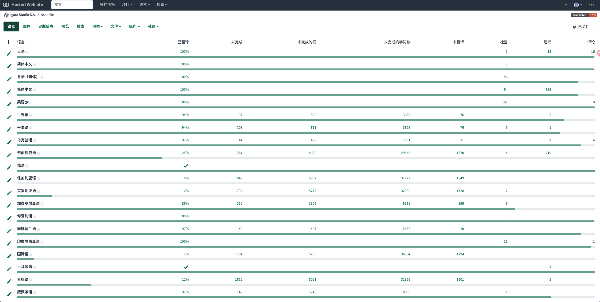
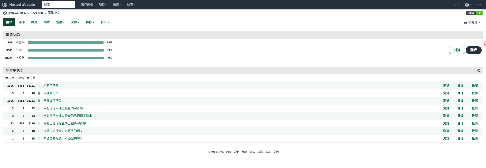
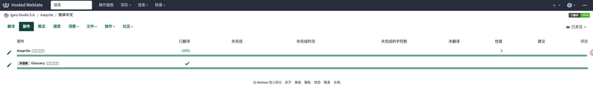
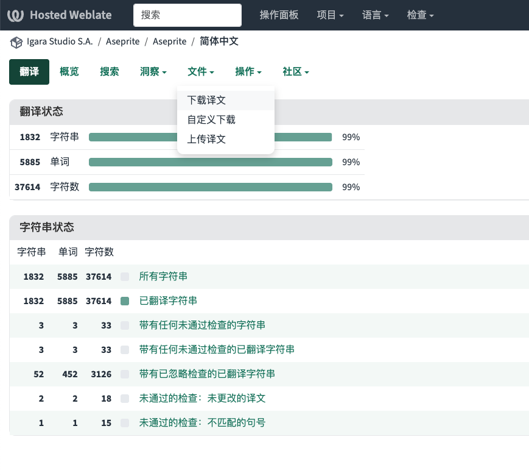
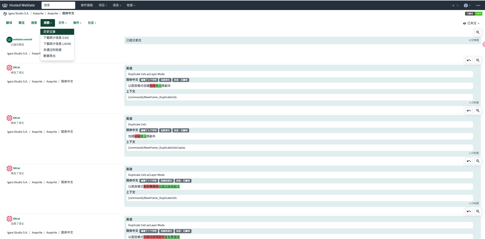
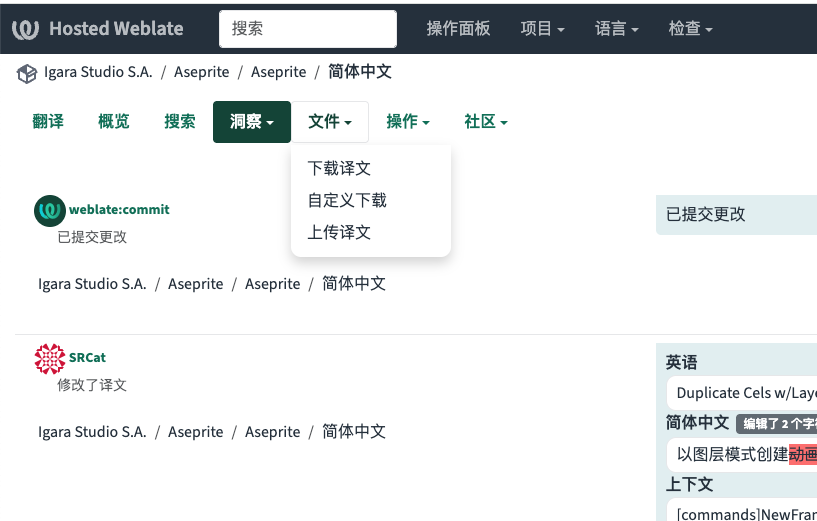
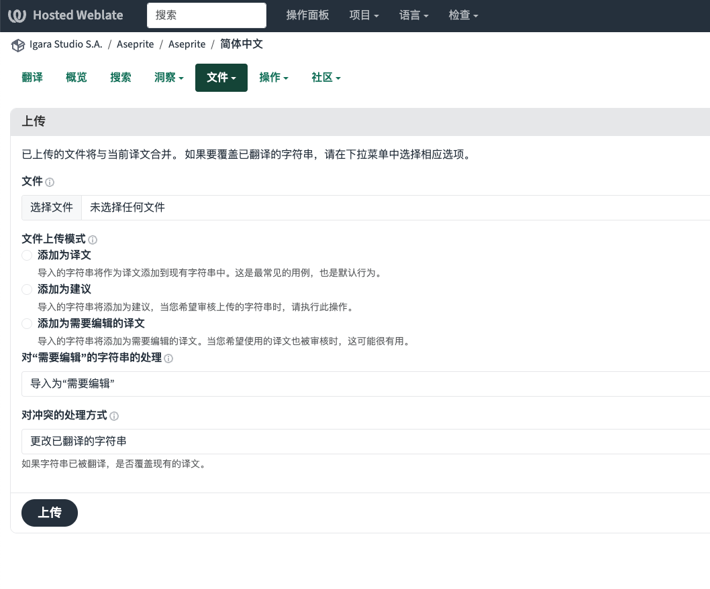

# Aseprite 翻译贡献指南

本文用于说明如何向 [Aseprite](https://github.com/aseprite) 提交翻译贡献。

> [!WARNING]
>
> 本文并非官方指南，所有内容均基于个人经验，仅供参考。

## 背景

从 [v1.3.3](https://github.com/aseprite/aseprite/releases/tag/v1.3.3) 开始，Aseprite 已内置官方翻译。这意味着：

- 正式发布的软件包会在 `data/strings` 目录中直接内置多国语言字符串，不再需要单独安装语言包扩展，但仍然支持语言包扩展。
- 翻译工作统一通过 [Weblate](https://hosted.weblate.org/projects/aseprite/) 进行。

目前 Weblate 处于开放提交状态，任何人都可以参与贡献。基于这一协作方式，我认为应遵循以下原则：

1. 目前没有所谓的官方翻译团队，所有翻译均由社区成员自愿贡献，用爱发电。
2. 即便如此，翻译内容和质量仍应尽可能建立在社区共识之上，尽管目前还没有相应机制提供保证。
3. 对翻译内容存在不同看法时，也应通过社区共识解决，尽管目前同样没有相应机制提供保证。
4. 贡献渠道完全开放，理论上存在有人故意破坏翻译的可能。不过目前尚未发生此类情况，而且翻译字符串由 Git 记录，可以进行追溯和还原，因此暂时不存在明显问题。

## 翻译字符串的工作原理

### INI 文件结构

Aseprite 使用 INI 格式保存翻译字符串，结构大致如下：

```ini
[_]
display_name = English

[advanced_mode]
title = Warning - Important
description = You are about to enter "Advanced Mode".
quit = You can go back by pressing "{}".
```

不同语言使用相同的小节和键，仅翻译对应的值。例如，简体中文版本如下：

```ini
[_]
display_name = 中文（简体）

[advanced_mode]
title = 警告 - 重要
description = 你即将进入“高级模式”。
quit = 按“{}”键可返回。
```

如果某种语言的翻译中缺少某个键，软件实际显示时会回退到英文版本。

Aseprite 还为 INI 值定义了一些特殊语法，具体规则不在本文展开，请参考其他文档。一般情况下，占位符和控制语法应与英文版本保持一致；换行则需要结合目标语言的语序和界面布局进行调整。

> [!WARNING]
>
> 我曾经编写过一个专用于 Aseprite ini 格式的处理库 https://github.com/aseprite-quest/aseprite-ini
>
> 翻译迁移至 Weblate 后该库已废弃，可能不再有效，仅供参考

所有翻译字符串均以 `.ini` 格式存放在软件的 `data/strings` 目录中。文件名以 [BCP 47](https://www.rfc-editor.org/info/bcp47) 语言标签为基础，但仓库约定使用下划线代替连字符，例如：

```text
en.ini
zh_Hans.ini
zh_Hant.ini
ja.ini
ko.ini
```

### 仓库与同步流程

Aseprite 的软件和翻译字符串分别存放在两个仓库中：

- 软件主仓库：[aseprite/aseprite](https://github.com/aseprite/aseprite)
- 翻译字符串仓库：[aseprite/strings](https://github.com/aseprite/strings)

软件主仓库的 `data/strings` 目录仅包含英文基准文件 `en.ini`，不包含其他语言的翻译文件；翻译字符串仓库则包含各语言的 INI 文件。

对于软件发布流程，或者需要自行构建 Aseprite 的情况，应先按照主仓库中的 [INSTALL.md](https://github.com/aseprite/aseprite/blob/main/INSTALL.md) 完成编译，再将字符串仓库中的翻译文件复制到 `data/strings` 目录，使多语言翻译生效。

Weblate 以 `aseprite/strings` 仓库作为翻译数据源，并与其双向同步。同步操作仅能由管理员执行，通常由 dacap 负责。管理员可以将 Weblate 上的翻译贡献转换为若干 Git 提交并推送到 strings 仓库，也可以直接更新 strings 仓库，再强制 Weblate 刷新翻译源。

后一种情况通常发生在 `en.ini` 更新时。软件开发过程中新增的翻译字符串会先出现在主仓库的 `en.ini` 中，需要由 dacap 将其同步到 strings 仓库并推送至 Weblate，社区才能在 Weblate 上翻译这些新字符串。

> [!WARNING]
>
> 这一工作流存在一定问题：dacap 有时会忘记更新 strings 仓库，可能直到软件发布若干版本后才进行更新和推送。因此，部分新增字符串可能要间隔若干版本才会进入翻译流程，具体取决于 dacap 何时处理。我个人建议在 strings 仓库中单独创建一个 Issue 说明此问题。

strings 仓库提供了格式化脚本 [format.py](https://github.com/aseprite/strings/blob/main/format.py)。该脚本会根据 `en.ini` 的结构和顺序重新整理所有翻译文件。由于 Weblate 推送翻译时不会保留字符串顺序，其他语言的字符串可能呈乱序状态，不便于对照，因此这个脚本对本地校对非常有用。

> [!WARNING]
>
> dacap 同步翻译后有时也会忘记执行该脚本。

## 常规翻译贡献流程

通常情况下，所有翻译都应通过 Weblate 提交。注册 Weblate 账号后，即可参与翻译。

1. 进入 [Aseprite 翻译主页](https://hosted.weblate.org/projects/aseprite/)。

   

2. 选择一种语言，进入对应的语言页面。

   

3. 打开“部件”标签页。此处包含两个项目。

   

   第一个项目是翻译字符串，大部分翻译工作都在这里进行。

   `Glossary` 是术语表，用于统一翻译过程中使用的专有名词。术语表并非强制规则，只会在翻译时提供参考，但对保持译文一致性很有帮助。

Weblate 的操作比较简单，并且提供了官方文档。本文不再详细介绍具体的翻译操作，直接上手体验通常更容易理解。

## 高级流程：使用完整翻译文件批量更新

> [!WARNING]
>
> 以下操作非常危险。如果操作不当，可能导致大量翻译字符串丢失或被错误覆盖。除非你清楚自己在做什么，否则请不要轻易尝试，应将这项工作交给熟悉流程的人处理。

Weblate 不太便于对全部翻译进行系统性校对。遇到这种情况时，可以使用 strings 仓库中的源文件在本地完成校对，再将完整翻译文件批量上传到 Weblate。

### 下载并整理翻译文件

1. 将 [aseprite/strings](https://github.com/aseprite/strings) 仓库克隆到本地。

2. 从 Weblate 下载目标语言的最新翻译文件。以简体中文为例，进入 [简体中文翻译页面](https://hosted.weblate.org/projects/aseprite/aseprite/zh_Hans/)。

   

3. 依次选择“文件”→“下载译文”。下载的简体中文文件通常名为 `aseprite-aseprite-zh_Hans.ini`，应按照仓库命名规范将其重命名为 `zh_Hans.ini`，再覆盖本地仓库中的同名文件。

之所以需要从 Weblate 重新下载，是因为 Weblate 上的翻译可能尚未同步到 strings 仓库。Weblate 中可能包含其他贡献者尚未同步的翻译，如果不先更新本地文件，这部分贡献就可能丢失。

### 格式化并校对

4. 在翻译仓库根目录中执行 `format.py`，按照 `en.ini` 的结构和顺序格式化翻译文件。该目录中必须同时包含 `en.ini`、目标语言文件和脚本。

   本项目也保存了一份脚本副本 [format-2.py](format-2.py)。脚本会为缺失的键生成 `TODO` 注释，格式如下：

   ```ini
   [_]
   display_name = 中文（简体）

   [advanced_mode]
   title = 警告 - 重要
   # TODO # description = You are about to enter "Advanced Mode".
   quit = 按“{}”键可返回。
   ```

   `# TODO #` 所在行属于注释，软件加载时会忽略。可以检索所有 `TODO`，参考英文原文补充对应译文，从而提高处理效率。
   
   这个脚本可能比默认脚本更好用。

> [!CAUTION]
>
> 格式化脚本会重写所在目录中的所有非英文 INI 文件，而不只处理当前校对的语言。执行前应确认工作区状态并保留现有差异；执行后必须检查改动，避免覆盖无关文件或其他贡献者的内容。

5. 补全翻译并完成校对。处理 `TODO` 时，必须移除注释前缀，将其改为有效的键值；随后将目标语言文件与英文原文进行整体对照。推荐使用 Git 或其他差异对比工具，以便检查修改内容。

除确认不存在残留的 `TODO` 外，还应检查小节和键是否完整、占位符与控制语法是否保留，以及动态参数是否与英文原文一致。

### 上传前检查

使用完成校对的翻译文件批量更新 Weblate 前，请务必遵循以下原则：

1. 不要创建 PR 向 strings 仓库提交更改，此类 PR 不会被接收。所有翻译更新都应通过 Weblate 提交。
2. 再次执行前面的下载步骤，确认校对期间没有其他人提交新的翻译贡献，否则可能丢失这些贡献。
3. 确保自己了解批量上传的具体影响。如果仍不确定，应将这项工作交给其他熟悉流程的人处理。

你也可以在“洞察”→“历史记录”中快速确认这段时间内是否存在其他翻译提交：

<https://hosted.weblate.org/projects/aseprite/aseprite/zh_Hans/#history>



### 批量上传翻译文件

确认以上事项后，即可开始批量更新。

1. 依次选择“文件”→“上传译文”。

   

2. 进入上传页面。

   

3. 选择本地的 `zh_Hans.ini` 文件。

4. 根据需要选择“添加为译文”或“添加为需要编辑的译文”。

   - “添加为建议”会创建一条建议，但不会立即生效，需要再次手动确认。
   - “添加为需要编辑的译文”会创建翻译并使其生效，同时附加“需要编辑”标记，便于稍后在 Weblate 上进行二次审核。该标记需要手动确认后才能消除。
   - 下方的“对‘需要编辑’的字符串的处理”选项与此同理。
   - “对冲突的处理方式”用于决定如何处理上传内容与现有译文之间的冲突。
   - 未翻译字符串会附带“未翻译”标记，其作用与“需要编辑”标记类似。

5. 完成选项设置后，点击“上传”按钮提交。

再次提醒：请务必确认自己了解批量上传的具体影响。错误操作可能造成翻译字符串被批量覆盖。

## 问题反馈与操作补救

如果遇到问题，可以在 [aseprite/strings](https://github.com/aseprite/strings) 仓库中创建 Issue 进行说明。

如果不慎在 Weblate 上进行了错误操作且无法自行恢复，也可以通过 Issue 联系 dacap，并说明涉及的语言、文件和操作过程，以便进行定位和补救。

## 翻译规则、AI 工作流与后续建议

[aseprite-strings-aiws](https://github.com/TakWolf-Deprecated/aseprite-strings-aiws) 是我个人的翻译辅助的 AI 工作流空间。其中的 [AGENTS.md](https://gitee.com/takwolf/aseprite-strings-aiws/blob/master/AGENTS.md) 包含部分翻译格式和规则说明，工作流中还提供了术语表校对流程。

以上内容仅供思路参考，不建议未经评估便直接将其作为新的翻译流程使用。

对于后续成立的新翻译组，建议先对现有译文进行一次整体校对，再以此为基础开展后续翻译工作。
